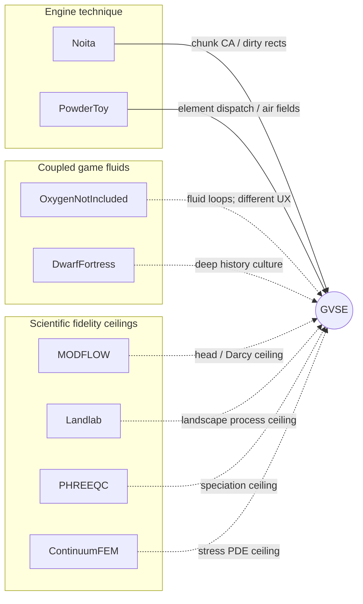

# Peer comparison — where GVSE sits

Positioning record for the active voxel stack (`wk-voxel` /
`wk-voxel-app`). Not a benchmark suite: a feature / fidelity map
against known games and scientific tools so scope creep has a fence.

**Product question** (from the root README): can a simple side-view
landscape accumulate readable geological history without numerical
instability, unbounded memory growth, or unexplained mass drift?

**One-line place on the map:** GVSE is a pannable side-view *research
prototype* — Noita / Powder Toy–class cell CA with closed mass
bookkeeping, painterly strata, and pixel-organism ecology. It is not a
platformer and not a continuum Earth or groundwater model.

## Fidelity ordinals

Matrix cells use a shared scale. “Higher” is not always better for
GVSE’s product question.

| Ordinal | Meaning |
|---------|---------|
| `none` | Absent or explicitly deferred |
| `toy` | Readable rules; no claim of physical units |
| `game-proxy` | Tuned for look / play / demo stability |
| `engineering` | Used for design / forecasting with known constitutive models |
| `research-grade` | Peer-method or code-compared scientific solvers |

Uncertain peer cells are marked from **public product descriptions**,
not lab runs against GVSE.

## Comparison axes

| Axis | What we score |
|------|----------------|
| Framing | Side cut, top-down colony, continuum domain, … |
| Spatial representation | Pixel CA, tiles/agents, mesh/columns |
| Hydrology | Free surface, pore water, confined head, mass audit |
| Solid earth / geotech | Strata, failure, karst, stress |
| Climate / energy | Day/night, heat, humidity, wind, precip |
| Life / ecology | Plants, fungi, microbes, animals, colony loops |
| Chemistry | Speciation vs opaque channels |
| Determinism & save | Seeds, replay, round-trip |
| Purpose | Gameplay, sandbox toy, research prototype, engineering tool |
| Typical scale | Order-of-magnitude length and cell / element size |

## Feature / fidelity matrix

### Framing, representation, purpose, scale

| Peer | Framing | Representation | Purpose | Typical scale (public / docs) |
|------|---------|----------------|---------|-------------------------------|
| **GVSE** | Side-view ring transect | 2D cell CA (64×64 chunks) | Research prototype / living diorama | Cell 0.25 m; app often ~0.25 km wide; [`WORLDGEN.md`](WORLDGEN.md) discusses ~1–4 km rings |
| Noita | Side-view levels | Falling Everything pixel CA | Action rogue-like | Pixel worlds, metres-scale arenas |
| Powder Toy | Sandbox canvas | Element particles + air grid | Creative physics sandbox | Screen / save canvases; no Earth transect |
| Oxygen Not Included | Top-down colony | Tile gas/liquid/heat | Colony management game | Base-sized asteroid maps |
| Dwarf Fortress | Top-down fortress / world | Tiles + agents | Deep simulation game | Regional embark; worldgen centuries |
| Terraria / Rain World | Side-view adventure | Tiles / crafted worlds | Action / exploration | Kilometre-class maps; thin geo sim |
| MODFLOW-class | Plan / 3D aquifer domain | Structured / unstructured cells | Groundwater engineering | Basin → regional (10²–10⁵ m) |
| Landlab / Badlands-class | Landscape surface | Grid / mesh process models | Geomorph research | Hillslope → catchment |
| PHREEQC-class | Batch / 1D / coupled | Speciation solver | Aqueous geochemistry | Lab → reactive transport couples |
| Continuum FEM (COMSOL-class) | User-meshed domain | PDE mesh | Multiphysics engineering | Component → site scale |

### Hydrology

| Peer | Free surface | Pore / subsurface | Confined / head | Mass discipline |
|------|--------------|-------------------|-----------------|-----------------|
| **GVSE** | `game-proxy` (Air+`sat`) | `game-proxy` (porosity cap + seepage) | `game-proxy` (upward head proxy) | First-class audit buckets ([`VOXEL_WATER.md`](VOXEL_WATER.md)) |
| Noita | `game-proxy` | `toy` / limited | `none`–`toy` | Gameplay stability, not inventory science |
| Powder Toy | `game-proxy` | `toy` | Pressure field (`game-proxy`) | Particle counts; not closed basin audit |
| ONI | `game-proxy` | pipes / tile fluids | pressure (`game-proxy`) | Game resource accounting |
| Dwarf Fortress | `toy`–`game-proxy` | aquifers (`game-proxy`) | limited | Fun > conservation proofs |
| MODFLOW-class | varies (often saturated focus) | `engineering`–`research-grade` | `engineering`–`research-grade` | Water balance reports; Darcy constitutive |
| Landlab / Badlands | surface routing (`research-grade` class) | often simplified | usually N/A | Process mass for sediment/water by design |
| PHREEQC-class | N/A (chemistry) | via coupling | via coupling | Mole balance |
| FEM continuum | `engineering` | `engineering` | `engineering` | Solver residuals / conservation options |

### Solid earth / geotech

| Peer | Strata / geology | Failure / stress | Karst / caves |
|------|------------------|------------------|---------------|
| **GVSE** | `game-proxy` painterly facies ([`STRATA.md`](STRATA.md)); runtime rewrite | `game-proxy` roof span + shear weaken; **no FEM** ([`VOXEL_FAILURE.md`](VOXEL_FAILURE.md)) | `game-proxy` limestone dissolve |
| Noita | destructible materials | pixel structural collapse (`game-proxy`) | diggable voids |
| Powder Toy | element solids | limited wall/pressure | diggable |
| ONI | dug materials | abyssalite / tile rules | dug spaces |
| Dwarf Fortress | layered worldgen geology | cave-ins (`game-proxy`) | cavern layers |
| MODFLOW-class | hydrostratigraphy inputs | usually not mechanical failure | conduit packages exist in some codes |
| Landlab / Badlands | strat / erosion focus | hillslope process laws | rare / specialized |
| FEM continuum | user materials | `engineering` stress–strain | geometry-dependent |

### Climate, life, chemistry

| Peer | Climate / energy | Life / ecology | Chemistry |
|------|------------------|----------------|-----------|
| **GVSE** | `game-proxy` day/night, T, humidity, wind, clouds, orographic rain | `toy`–`game-proxy` module plants/fungi/atoms; animals deferred ([`organism/CORE_FEATURES.md`](organism/CORE_FEATURES.md)) | `toy` — few opaque `ChemType` channels; crude C budget |
| Noita | spells / materials as weather toys | creatures as gameplay agents | reaction table (`game-proxy`) |
| Powder Toy | heat / pressure / gravity tools | none as ecology | element reactions (`game-proxy`) |
| ONI | heat/gas loops central | critters + plants as colony systems | element reactions (`game-proxy`) |
| Dwarf Fortress | seasons, weather | deep ecology + economy | materials / syndromes (`game-proxy`) |
| Land-surface / LSM-class | `engineering`–`research-grade` | veg / carbon schemes | biogeochem schemes |
| PHREEQC-class | via coupling | N/A | `research-grade` speciation |
| MODFLOW / FEM | usually coupled externally | usually external | usually external |

### Determinism and save

| Peer | Determinism | Save / replay |
|------|-------------|----------------|
| **GVSE** | Content-addressed seeds; parallel CA with locked order | `*.gvsesim` postcard; `#[serde(default)]` round-trip invariant |
| Noita | Seeded runs; pixel chaos amplified | Game saves |
| Powder Toy | Seeded saves common | Native save format |
| ONI / DF / Terraria | Game RNG + seeds vary | Game saves |
| Scientific stack | Reproducible inputs / versions expected | Checkpoint / restart culture |

## Where GVSE is unusually strong

Relative to this peer set — not absolute scientific truth:

1. **Mass conservation as a product requirement** — inventory buckets and audit smoke tests, not only “looks stable.”
2. **One cell store for free surface and pore water** — Air+`sat` plus porosity-capped solids, with seepage between them.
3. **Readable strata that the runtime may rewrite** — authored facies, then erosion, karst, collapse, fungal soil.
4. **Petri dish = scrolled world** — organism studio edits the same grid the climate and CA tick.
5. **Falsification culture** — E-series scenarios for hydro and life; isolation guardrails vs the failed column stack ([`VOXEL_MIGRATION.md`](VOXEL_MIGRATION.md)).

## Where GVSE is weaker / out of class

1. **No Darcy / FEM constitutive truth** — roof-span and wet-column geotech are proxies; continuum solvers win on stress and head fields.
2. **No aqueous speciation** — PHREEQC-class chemistry is a different product; organism chem is signalling channels.
3. **No colony / animal gameplay loop** — ONI and DF own critter economies; Core explicitly defers hunting and locomotion.
4. **Small transect vs regional models** — demo rings are hundreds of metres to a few kilometres, not catchment or basin studies.
5. **Artistic deep time** — no plate tectonics or orogeny simulation ([`STRATA.md`](STRATA.md)).

## Nearest-neighbor map

Solid arrows: techniques GVSE already borrows. Dotted arrows: neighbors that define a ceiling or adjacent culture, not a port target.

## Roadmap implications

Steering from the matrix — double down on the product question; do not chase peer home turf.

| Do double down | Do not chase as Core |
|----------------|----------------------|
| Mass-audit scenarios and closed-basin demos ([`VOXEL_WATER.md`](VOXEL_WATER.md)) | MODFLOW-equivalent Darcy solvers |
| Readable strata narratives after runtime rewrite ([`STRATA.md`](STRATA.md)) | Plate tectonics / deep-time orogeny |
| Organism–hydro–carbon coupling demos in the same scrolled world | PHREEQC speciation or full biochemistry |
| Geotech overlays that explain collapse *visually* ([`VOXEL_GEOTECH_MAP.md`](VOXEL_GEOTECH_MAP.md)) | Continuum FEM / Mohr–Coulomb tensors ([`VOXEL_FAILURE.md`](VOXEL_FAILURE.md) non-goals) |
| Deterministic seeds + save round-trip as lab hygiene | Colony logistics / animal hunting loops ([`organism/CORE_FEATURES.md`](organism/CORE_FEATURES.md) non-goals) |
| Technique notes from Noita / Powder Toy when optimizing CA ([`VOXEL_MIGRATION.md`](VOXEL_MIGRATION.md) §10) | Replacing gameplay peers feature-for-feature |

## Sources

**GVSE (in-tree)**

- [`../README.md`](../README.md) — pitch, scale, crates
- [`VOXEL_WATER.md`](VOXEL_WATER.md) — water CA + mass inventory
- [`VOXEL_FAILURE.md`](VOXEL_FAILURE.md) — geotech proxies; FEM non-goal
- [`VOXEL_GEOTECH_MAP.md`](VOXEL_GEOTECH_MAP.md) — stress overlays
- [`VOXEL_MIGRATION.md`](VOXEL_MIGRATION.md) — isolation; Noita / Powder Toy bibliography
- [`WORLDGEN.md`](WORLDGEN.md) — ring sizes and topology
- [`STRATA.md`](STRATA.md) — artistic geology stance
- [`organism/CORE_FEATURES.md`](organism/CORE_FEATURES.md) — life Sets A–E and non-goals

**Peers (public descriptions; not lab comparisons)**

- Petri Purho, *Exploring the Tech and Design of 'Noita'*, GDC 2019 — links in [`VOXEL_MIGRATION.md`](VOXEL_MIGRATION.md)
- [The Powder Toy](https://github.com/The-Powder-Toy/The-Powder-Toy)
- Oxygen Not Included, Dwarf Fortress, Terraria, Rain World — published game design / manuals
- [USGS MODFLOW](https://www.usgs.gov/mission-areas/water-resources/science/modflow-and-related-programs)
- [Landlab](https://landlab.github.io/), [Badlands](https://badlands.readthedocs.io/)
- [PHREEQC](https://www.usgs.gov/software/phreeqc-version-3)
- Continuum multiphysics FEM tools (COMSOL-class) — vendor documentation for constitutive scope
