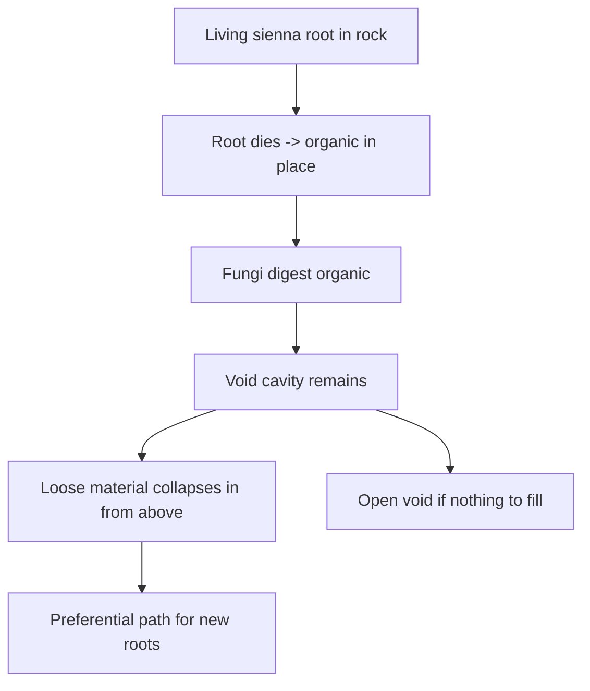

# Fungi and the detritus cycle

*Frozen litter-fungus reference, cream hyphae grammar, per-column
substrate enum, ghost-root lifecycle. `detritus-cycle` in the
Organism Kernel plan.*

## Reference creature F — litter fungus

MS Paint mid-soil view (litter band above, rock below):

```
   litter band:
   ■ cream — ■ cream — ■ brown-red — ■ black — ■ cream
              (hypha threads)         (digest)  (nucleus)
```

Modules:

- `Nucleus` (black) — genome home. Same rules as any other Atom.
- `Digest` (brown-red) — converts local `organic(x,y)` into energy.
- `Hypha` (cream, 1-px line) — extends digest reach across adjacent
  litter, soil, or standing-dead cells.
- No `Photosystem`. Fungi harvest surplus that other organisms
  leave behind, not light.

A rare mutant may grow `Photosystem` on top of a fungal chassis
(green parasite variant); explicitly deferred, keep the slot but do
not design.

## Hypha vs axon

Both are 1-pixel lines in the palette. Different colour, different
role:

| Line | Colour | Job |
|------|--------|-----|
| `Axon` | Gray `#AAAAAA` | Carries neural signal between modules and soma. |
| `Hypha` | Cream `#F1E6C4` | Carries nutrients between `Digest` and reachable food cells. Extends digest range. Costs upkeep per pixel of length. |

Hyphae only carry food, never neural control. Fungi may still have a
soma + axons if the blueprint draws them.

## Digest reach

`Digest` alone harvests only the cell it occupies:

```
harvest = min(digest_rate, organic(x, y)) * DIGEST_EFFICIENCY
```

Adding hyphae extends the reach: any cell reachable through a
contiguous chain of cream pixels from the `Digest` module counts.
Hyphae have upkeep per pixel; long hyphae in dry soil stall and
retract (see the substrate rules below).

## Substrate enum

Introduce a per-column tag (or per-cell tag when we go coarser
still):

```rust
#[repr(u8)]
pub enum SubstrateTag {
    Rock   = 0,   // competent bedrock; roots bore slowly
    Loose  = 1,   // sand, collapsed sediment, prior root fill
    Organic = 2,  // organic-rich soil (living or fresh dead root mass)
    Void   = 3,   // hollow (cavity from prior root or karst)
}
```

- Serialised with `#[serde(default = "SubstrateTag::rock")]` so
  pre-organism saves default to `Rock`.
- Lives per-column on the `Column` struct for the first pass, next
  to `moisture` and `ecology`. If per-cell granularity turns out to
  matter (Set E work), promote it into a sparse per-cell tag on
  the karst void patch machinery already in
  [`crates/legacy/wk-world/src/karst.rs`](../../crates/legacy/wk-world/).
- Ties to `MaterialId::Organic` once organic gets a real layer type:
  a column whose top layer is `MaterialId::Organic` reports
  `SubstrateTag::Organic` automatically; the tag is a *derived*
  view over material + void state, with an explicit override slot
  for `PreferentialRootPath`.

## Ghost-root lifecycle

The cascade the design doc calls the "organism→geology handshake":



1. **Live.** Sienna occupies rock cells; live root pays the rock
   penetrate cost (energy tax on elongate).
2. **Die.** Nucleus dies or the root is severed. Sienna cells
   convert in place to `Organic` mass (contributes to
   `MassAudit::biomass_decay_total`, or later to an actual
   `MaterialId::Organic` layer).
3. **Digest.** Cream hyphae reach the standing-dead root and pull
   the `organic` down through `Digest`. When the cell's `organic`
   is empty, its `SubstrateTag` flips to `Void`.
4. **Fill.** If the cell above the void has loose material, it
   collapses in (`SubstrateTag: Void` → `Loose`, one column per
   tick). Karst-style roof rules apply if the cavity is wide.
5. **Memory.** A void that has been backfilled with loose material
   is now the cheapest substrate for a new root. Optional
   `PreferentialRootPath: bool` overlay on the column marks it,
   even after later mass changes may have pushed the tag back
   toward `Rock` again.
6. **Open voids.** If nothing above can fill (competent rock roof),
   a lasting cavity remains. This is the honest handshake into
   the karst / burrow vocabulary already in
   [`docs/BURROWS.md`](../BURROWS.md) — a fungal cavity is a
   burrow that wasn't dug.

Incentives this creates:

- Old tree sites become **easier to re-root**. Woodland patches
  self-reinforce (legacy soils, "there was a tree here" memory).
- Fungi are not only recyclers of energy — they are **geomorphic
  agents**. They open the cavity.
- Epiphyte → topple → root-death on the same individual can leave a
  whole underground stencil of voids and fill under the stump.
- First pioneer on virgin rock is expensive; second generation is
  subsidised by the corpse of the first.

## Coupling to existing GVSE

- `organic(x,y)` reads:
  - For litter above ground: the column's `Ecology.dead_biomass`
    (see [`docs/ECOLOGY.md`](../ECOLOGY.md)).
  - For dead root mass in soil: a new per-column
    `dead_root_biomass` bucket, or (Phase 6) the eventual
    `MaterialId::Organic` layer. The choice locks in Phase 6,
    but the interface is a single `column.organic_at(y)` accessor.
- Fungal digest books mass into `MassAudit::biomass_decay_total` — no
  new audit bucket needed until Phase 3 tests reveal one is missing.
- Void cavity creation ties into the existing karst void patch data:
  a fungal void is a `Void` with `origin: FungalCavity` alongside
  `origin: Karst` / `origin: Burrow`. This gives roof-collapse and
  water-capture the same handling regardless of how the cavity was
  born.
- Loose fill collapse reuses `run_slumping` logic — the fill event
  is a slumping call with an oversize threshold rather than a new
  subsystem.

## Voxel path (wk-voxel) — fruiting body + mycelium field

The live voxel stack diverges from the ghost-root cavity cascade above
on purpose (see [`VOXEL_PLANTS.md`](VOXEL_PLANTS.md) E1):

- **Fruiting body** — studio creature (`F`). Temporary. Seeds / feeds from
  the mycelium field; may die of age while the network remains.
- **Mycelium field** — intensity in `Cell::_pad` on Organic. World process
  (`step_mycelium_field`): thickens and spreads on moist Organic without a
  living fruiting body. Threads prefer climbing toward free Air. Renderer:
  faint cream threads.
- **Emergence** — only after the network has **breached the surface**
  (colonized Organic open to Air *and* feeder mycelium below/beside).
  `try_emergent_fruiting` seats a stalk in Air and burns field intensity.
- **Two dispersal habits** (`try_spore`, needs painted `ReproSpore`):
  - *Underground* (nucleus in Organic) — short rhizomorph hops that seed
    mycelium nearby (no wind / surface gate).
  - *Surface stalk* (nucleus in Air) — wind carries spores far once the
    column is surface-ready. App: lilac puffs on climate wind (`SporeFx`).
- **Anti-flood:** one living fruiting body per column, soft local density
  (≤6 in ±4 columns), long child cooldown; babies aren't network-immortal
  until mature. HUD shows `p=/f=/a=` habit split.
- Soft litter is a bonus sip — fungi do **not** flash Organic into Sand.
- Fruiting seats **prefer Air on Organic/Soil** (visible stalks). Buried
  Organic seats remain for rhizomorph hops (`prefer_surface = false`).
- Mycelium compost (Organic → `MaterialId::Soil`, pore water preserved)
  is gated by live [`FungiConfig`] knobs (Tab → Life → Fungi / compost).
  Defaults are faster than the old hard-coded `220 / 1-in-6000` so thick
  litter blankets humify before plants lose pore water.
- Crude global **carbon buckets** (atmosphere + dissolved) live beside
  the water mass store: surface Organic can oxidize to Soil and credit
  atm C; lakes exchange atm ↔ dissolved on a slow cadence. Algae /
  O₂ creatures can draw these pools later — not a per-tick chemistry field.

Ghost-root Void fill remains a column-kernel / later voxel goal.

## What is deliberately not here

- True mycorrhizae (mutualist hypha↔root sugar/water exchange). The
  cream-line-to-live-sienna slot is drawn but unused in Core.
- Dedicated fruiting-body *geometry* modules — surface fruiting is still
  Digest + Hypha + `ReproSpore` on a Nucleus chassis (palette `Fruit` /
  bark stay reserved). Land plants share `ReproSpore` for fern-style
  wind dispersal (see [`VOXEL_PLANTS.md`](VOXEL_PLANTS.md) D3b).
- Pathogenic fungi on living plants. Deferred until active predation
  makes sense.
- Full geotechnical fill mechanics. One tick per loose-collapse
  step is enough.
