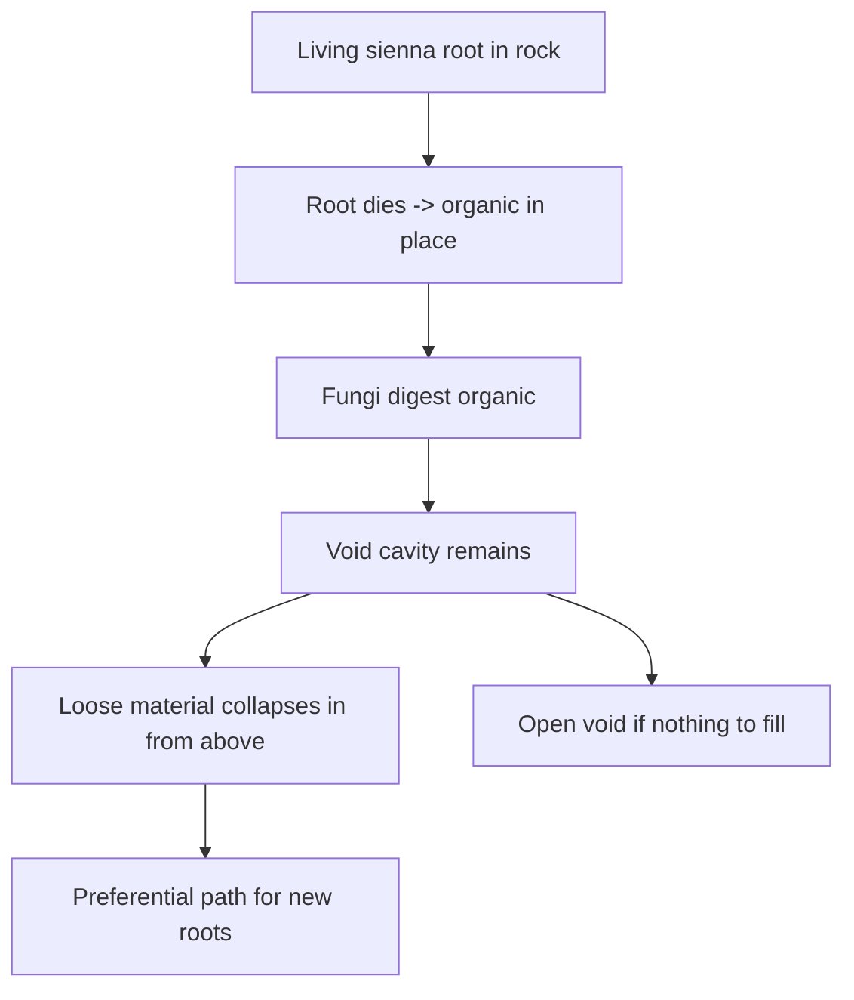

# Fungi and the detritus cycle

*Frozen litter-fungus reference, cream hyphae grammar, per-column
substrate enum, ghost-root lifecycle. `detritus-cycle` in the
Organism Kernel plan.*

## Reference creature F — litter fungus

MS Paint mid-soil view (litter band above, rock below):

```
   litter band:
   ■ cream — ■ cream — ■ brown-red — ■ black — ■ cream
              (hypha threads)         (digest)  (nucleus)
```

Modules:

- `Nucleus` (black) — genome home. Same rules as any other Atom.
- `Digest` (brown-red) — converts local `organic(x,y)` into energy.
- `Hypha` (cream, 1-px line) — extends digest reach across adjacent
  litter, soil, or standing-dead cells.
- No `Photosystem`. Fungi harvest surplus that other organisms
  leave behind, not light.

A rare mutant may grow `Photosystem` on top of a fungal chassis
(green parasite variant); explicitly deferred, keep the slot but do
not design.

## Hypha vs axon

Both are 1-pixel lines in the palette. Different colour, different
role:

| Line | Colour | Job |
|------|--------|-----|
| `Axon` | Gray `#AAAAAA` | Carries neural signal between modules and soma. |
| `Hypha` | Cream `#F1E6C4` | Carries nutrients between `Digest` and reachable food cells. Extends digest range. Costs upkeep per pixel of length. |

Hyphae only carry food, never neural control. Fungi may still have a
soma + axons if the blueprint draws them.

## Digest reach

`Digest` alone harvests only the cell it occupies:

```
harvest = min(digest_rate, organic(x, y)) * DIGEST_EFFICIENCY
```

Adding hyphae extends the reach: any cell reachable through a
contiguous chain of cream pixels from the `Digest` module counts.
Hyphae have upkeep per pixel; long hyphae in dry soil stall and
retract (see the substrate rules below).

## Substrate enum

Introduce a per-column tag (or per-cell tag when we go coarser
still):

```rust
#[repr(u8)]
pub enum SubstrateTag {
    Rock   = 0,   // competent bedrock; roots bore slowly
    Loose  = 1,   // sand, collapsed sediment, prior root fill
    Organic = 2,  // organic-rich soil (living or fresh dead root mass)
    Void   = 3,   // hollow (cavity from prior root or karst)
}
```

- Serialised with `#[serde(default = "SubstrateTag::rock")]` so
  pre-organism saves default to `Rock`.
- Lives per-column on the `Column` struct for the first pass, next
  to `moisture` and `ecology`. If per-cell granularity turns out to
  matter (Set E work), promote it into a sparse per-cell tag on
  the karst void patch machinery already in
  [`crates/legacy/wk-world/src/karst.rs`](../../crates/legacy/wk-world/).
- Ties to `MaterialId::Organic` once organic gets a real layer type:
  a column whose top layer is `MaterialId::Organic` reports
  `SubstrateTag::Organic` automatically; the tag is a *derived*
  view over material + void state, with an explicit override slot
  for `PreferentialRootPath`.

## Ghost-root lifecycle

The cascade the design doc calls the "organism→geology handshake":



1. **Live.** Sienna occupies rock cells; live root pays the rock
   penetrate cost (energy tax on elongate).
2. **Die.** Nucleus dies or the root is severed. Sienna cells
   convert in place to `Organic` mass (contributes to
   `MassAudit::biomass_decay_total`, or later to an actual
   `MaterialId::Organic` layer).
3. **Digest.** Cream hyphae reach the standing-dead root and pull
   the `organic` down through `Digest`. When the cell's `organic`
   is empty, its `SubstrateTag` flips to `Void`.
4. **Fill.** If the cell above the void has loose material, it
   collapses in (`SubstrateTag: Void` → `Loose`, one column per
   tick). Karst-style roof rules apply if the cavity is wide.
5. **Memory.** A void that has been backfilled with loose material
   is now the cheapest substrate for a new root. Optional
   `PreferentialRootPath: bool` overlay on the column marks it,
   even after later mass changes may have pushed the tag back
   toward `Rock` again.
6. **Open voids.** If nothing above can fill (competent rock roof),
   a lasting cavity remains. This is the honest handshake into
   the karst / burrow vocabulary already in
   [`docs/BURROWS.md`](../BURROWS.md) — a fungal cavity is a
   burrow that wasn't dug.

Incentives this creates:

- Old tree sites become **easier to re-root**. Woodland patches
  self-reinforce (legacy soils, "there was a tree here" memory).
- Fungi are not only recyclers of energy — they are **geomorphic
  agents**. They open the cavity.
- Epiphyte → topple → root-death on the same individual can leave a
  whole underground stencil of voids and fill under the stump.
- First pioneer on virgin rock is expensive; second generation is
  subsidised by the corpse of the first.

## Coupling to existing GVSE

- `organic(x,y)` reads:
  - For litter above ground: the column's `Ecology.dead_biomass`
    (see [`docs/ECOLOGY.md`](../ECOLOGY.md)).
  - For dead root mass in soil: a new per-column
    `dead_root_biomass` bucket, or (Phase 6) the eventual
    `MaterialId::Organic` layer. The choice locks in Phase 6,
    but the interface is a single `column.organic_at(y)` accessor.
- Fungal digest books mass into `MassAudit::biomass_decay_total` — no
  new audit bucket needed until Phase 3 tests reveal one is missing.
- Void cavity creation ties into the existing karst void patch data:
  a fungal void is a `Void` with `origin: FungalCavity` alongside
  `origin: Karst` / `origin: Burrow`. This gives roof-collapse and
  water-capture the same handling regardless of how the cavity was
  born.
- Loose fill collapse reuses `run_slumping` logic — the fill event
  is a slumping call with an oversize threshold rather than a new
  subsystem.

## Voxel path (wk-voxel) — inoculum → mycelium → rare fruiting

The live voxel stack diverges from the ghost-root cavity cascade above
on purpose (see [`VOXEL_PLANTS.md`](VOXEL_PLANTS.md) E1):

- **Editor plant (`F`)** — paints a fruiting-body chassis; terrain click
  calls `infect_mycelium_with_lineage`: cream on a porous host (+ short
  feeder column) **and** stamps that genome/body into
  `World::mycelium_lineage`. **No living Atom** until the network emerges.
- **Mycelium field** — intensity in `Cell::_pad` on porous hosts
  (Organic food; Soil / Sand / Clay easier when moist; loose rock harder;
  Stone rare cracks; Bedrock refuses). World process
  (`step_mycelium_field`) goal-seeks Organic and the free surface.
  **Organic** thickens into a real colony (shared 255 budget). **Mineral**
  is a cheap search/conduit: soft-capped while seeking, then tapers toward
  a thin connection once it touches threaded Organic (no fat mineral
  blobs).   **Sugar-funded exploration:** virgin mineral probes (esp. dry
  rock) cost network sugar scaled by host difficulty — hungry tips cannot
  free-probe hostile terrain, but a large connected bank can pull sugar to
  a tip and send exploratory hyphae through dry sand/stone. Sugar-rich
  Organic hubs also run occasional explore-only spread rolls (skip further
  Organic thicken) so they push search hyphae into dry beds below a fed
  colony instead of painting food forever. Funded dry corridors fade
  slowly; broke dry tips fade faster and may disconnect until
  remoistened/refunded. Compost leaves a residual cream corridor on
  Soil **only when the Organic already had cream** — virgin surface
  oxidation must not invent orphan `mycelium=1` soil. Each field pulse
  processes a rotating, frontier-biased sample (perf cap) so dense hubs
  cannot permanently starve climb / food-seeking fronts.
  Renderer: faint cream threads (stronger on Organic).
- **Network sugar** — sparse `World::mycelium_energy` (0..=255 per cream
  cell): a glucose analog banked on moist Organic (and occasional soft
  litter sips). Same-strain cream adjacent-bleeds and **pulls within ~6
  cells** so a wet hub can fund a distant dry tip or desert plant contact.
  Mineral corridors pay light upkeep; probes spend sugar. Fruiting bodies
  sip nearby sugar into `Atom.energy`; emergence burns cream + sugar.
  Migrates with grain/raft moves. Symbiont plants pay into / draw from
  this bank (see below).
- **Symbiont treaty** — opt-in `ModuleId::Symbiont` (`0x16`, mint) on both
  the plant body and the fungus lineage body. Genome `(sym_water,
  sym_energy)` is a mutable agreed deal (editor: `8` paint, `,/.` W,
  `-/=` E). Match is assortative similarity of the two vectors; a shared
  lopsided vector is parasitism (high W / low E favours the plant; low W /
  high E favours the fungus). On root↔cream contact the fungus donates
  pore water and the plant pays `Atom.energy` into network sugar.
  Trade is **moisture-directed** at each root↔cream contact: **supply** when
  cream is wetter (network gives water, plant pays sugar) and **harvest** when
  the root bed is wetter (plant gives water, network pays sugar into plant
  energy). Plants keep a **reproduction reserve** (`SYM_REPRO_RESERVE_FRAC` =
  rhizome sprout threshold of spawn tank) that supply sugar pay cannot spend —
  water may still arrive while the plant banks toward sprouting. Networks leave
  a small local sugar floor (`SYM_NET_SUGAR_PAY_RESERVE`) when paying plants or
  other strains. Contacts may **pull** water/sugar from the wider same-strain
  pipe first — so a wet deep hub can support a desert plant, and a shallow
  plant-rich strain can buy water from a deep wet strain at their frontier.
  Inspector shows treaty, link state, trade mode, banking flag, both-direction
  ledgers, potential rates, and bias. Root modules may **cohabit** the same
  Organic cell as cream (mycorrhizal contact); deep cream of a linked strain
  reports `via network`, and idle cream under a linked plant says
  `idle here (plant linked elsewhere)` so the plant and block lines agree.
  Plant ledger lives on the Atom; network ledger is `World::sym_net_flow`
  keyed by **strain id**. **Strain↔strain**
  trade: adjacent cream cells with different **dominant** strains exchange when
  both lineages paint Symbiont and treaties match
  (`World::mycelium_strain_lineage`). Wetter gives water, drier pays sugar;
  when moisture is nearly equal (soaked beds), sugar-rich peers trickle sugar
  to poorer matching neighbours. Inspector shows `sym frontier` with peer
  strain, moist/sugar gap, and ready/blocked reason. Overlay rainbow
  dithering on one cell is multi-share blending — not a frontier (same-cell
  barter still deferred). Frontiers are sampled from real dominant-strain
  edges (not a random cream subset).
- **Multi-strain shares** — a cell’s 255 cream budget is shared. Each
  inoculum mints a strain id; several strains can hold intensity on the
  same block (`strain A 40/255`, `strain B 60/255`, …; `_pad` = sum).
  Spread adds into free room without wiping neighbours.
- **Strain overlay (`M`)** — `World::mycelium_strains` lists per-cell
  shares. Overlay blends bright golden-angle colors by share weight with a
  high alpha floor so thin mineral climb corridors stay neon-readable (not
  dark-green veins). Grain/raft/erosion **and roof-collapse debris** migrate
  shares with the host cell so piles keep strain color (cream `_pad` alone
  without shares used to paint orphan red dots). Each field pulse also runs a
  full-world orphan heal: shareless cream inherits a neighbour strain or
  clears (never mints a fake strain). Inspector lists every strain on the cell.
- **Emergence** — a rare forest event. Only after the network has
  **breached the surface** (colonized Organic open to Air *and* feeder
  mycelium below/beside — feeders may be mineral corridors), with high
  intensity (`MYCELIUM_EMERGE_MIN`), slow cadence, and sparse local
  density. `try_emergent_fruiting` seats a stalk from the cream cell's
  **strain-bound lineage** first (so Symbiont / custom designs survive long
  corridors), then a nearby spatial stamp, else `minimal_fungus`, and burns
  field intensity. Spore inoculum runs `ensure_symbiont_inherited` after
  morphological mutation so opt-in Symbiont is not a one-generation dead end.
- **Fruiting body** — temporary Atom. Feeds from the field / litter; when
  a surface stalk sporulates it **collapses** → corpse → litter → Organic.
  Mushrooms should feel special, not wallpaper the slope.
- **Two dispersal habits** (`try_spore`, needs painted `ReproSpore`) —
  both **mutate** genome/body then **inoculate mycelium** (never birth a
  child fruiting Atom):
  - *Underground* (nucleus in Organic) — short rhizomorph hops (no wind).
  - *Surface stalk* (nucleus in Air) — wind carries inoculum far
    (`FUNGUS_STALK_SPORE_MIN_DIST`…`MAX`, up to ~72 cols) once the column
    is surface-ready; stalk then dies. App: lilac puffs (`SporeFx`).
- **Anti-flood:** one living fruiting body per column, tight local density
  (≤2 in ±4 columns), slow emergence odds / period; babies aren't
  network-immortal until mature. HUD shows `p=/f=/a=` habit split.
- Soft litter is a bonus sip — fungi do **not** flash Organic into Sand.
- Fruiting seats **prefer Air on Organic/Soil** (visible stalks). Buried
  Organic seats remain for rhizomorph hops (`prefer_surface = false`).
- Mycelium compost (Organic → `MaterialId::Soil`, pore water preserved,
  residual cream) is gated by live [`FungiConfig`] knobs
  (Tab → Life → Fungi / compost). Defaults are faster than the old
  hard-coded `220 / 1-in-6000` so thick litter blankets humify before
  plants lose pore water. Per-cell humify is why colonized beds can look
  “square” — Soil patches replace Organic voxels, not a drawn rectangle.
- **Mycelium stickiness** uses the same cream intensity (`Cell::_pad`
  0..=255): colonized Organic holds short repose faces and resists flow
  scour; floating mats with myc ≥ ~40 sail as cohesive rafts and
  waterlog slower than bare litter. No separate sticky material.
- Crude global **carbon buckets** (atmosphere + dissolved) live beside
  the water mass store: surface Organic can oxidize to Soil and credit
  atm C; lakes exchange atm ↔ dissolved on a slow cadence. Set A algae
  draw dissolved C (bloom harvest throttles when the pool empties);
  land plants lightly pull atmosphere on photo growth, with a photo floor
  so empty air never hard-zeros forests. Buckets persist in `.gvsesim`
  saves. O₂ creatures later — not a per-cell chemistry field.
- **Spore bank** (`World::spore_bank`): fungus packets that cannot infect
  on landing (no host, cold) stay tied to that cell and **inoculate cream
  + lineage** on wake — they do not stamp living fruiting bodies. Plant
  packets still germinate as living sprouts when seats open.

Ghost-root Void fill remains a column-kernel / later voxel goal.

## What is deliberately not here

- True mycorrhizae (mutualist hypha↔root sugar/water exchange). The
  cream-line-to-live-sienna slot is drawn but unused in Core.
- Dedicated fruiting-body *geometry* modules — surface fruiting is still
  Digest + Hypha + `ReproSpore` on a Nucleus chassis (palette `Fruit` /
  bark stay reserved). Land plants share `ReproSpore` for fern-style
  wind dispersal (see [`VOXEL_PLANTS.md`](VOXEL_PLANTS.md) D3b).
- Pathogenic fungi on living plants. Deferred until active predation
  makes sense.
- Full geotechnical fill mechanics. One tick per loose-collapse
  step is enough.
